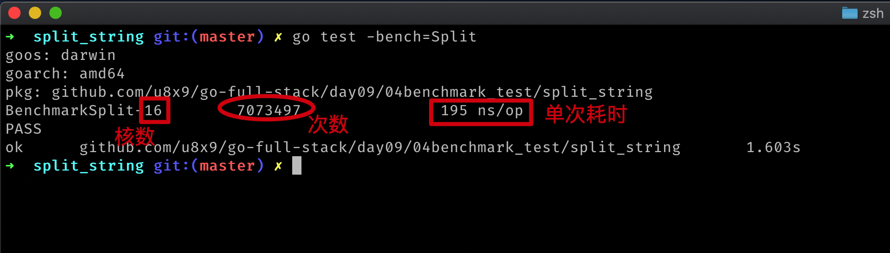
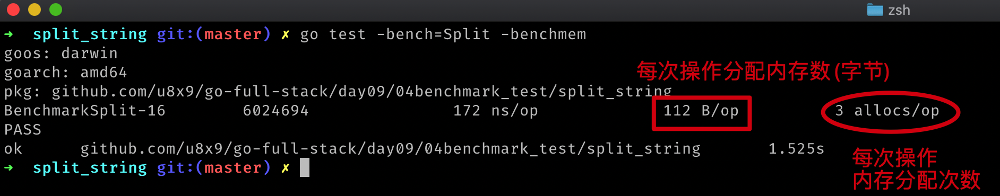

# 基准测试

在一定的工作负载下检测程序性能的一种方法。

## 函数格式

```go
func BenchmarkXXX(b *testing.B)
```

基准测试必须要执行`b.N`次，这样的测试才有对照性。`b.N`的值是系统根据实际情况去调整的，从而保证测试的稳定的性。

## 执行基准测试

```bash
go test -bench=XXX
```

如果要执行所有基准测试，`-bench=.`

### 结果



## 带内存分配

```bash
go test -bench=Split -benchmem
```



