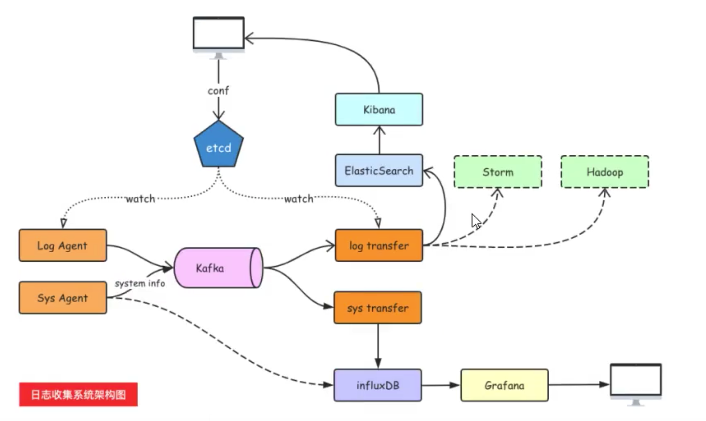

# 日志收集

[toc]

## 架构



## Kafka

### 安装

```bash
wget https://mirrors.tuna.tsinghua.edu.cn/apache/kafka/2.6.0/kafka_2.13-2.6.0.tgz

tar zxvf kafka_*.tgz -C /path/of

export KAFKA_HOME=/path/of/kafka
```

### 启动 ZooKeeper

```bash
$KAFKA_HOME/bin/zookeeper-server-start.sh $KAFKA_HOME/config/zookeeper.properties
```

### 启动 Kafka Server

```bash
$KAFKA_HOME/bin/kafka-server-start.sh $KAFKA_HOME/config/server.properties
```
## log agent 开发

### 工作流程

+ 读日志 -- tailf 第三方库

+ 往kafka里写日志-- sarama 第三方库

