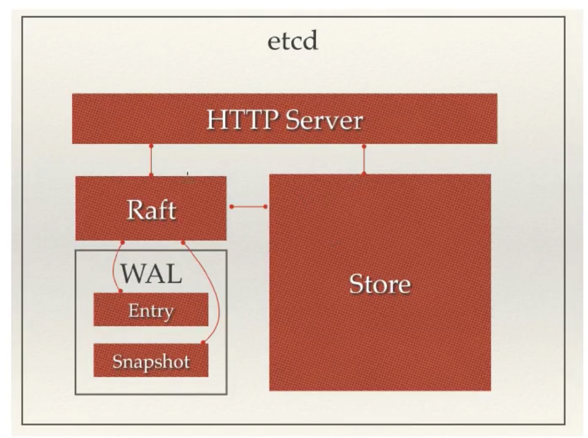

# etcd

是使用go语言开发的一个开源的、高可用的、分布式key-value存储系统。可以用于配置共享和服务的注册和发现。

类似项目有 zookeeper 和 consul。

它具有以下特点：

+ 完全复制：集群中的每个节点都可以使用完整的存档

+ 高可用性：etcd可用于避免硬件的单点故障或网络问题

+ 一致性：每次读取都会返回跨多主机的最新写入

+ 简单：包括一个定义良好、面向用户的api(gRPC)

+ 安全：实现了带有可选的客户端证书身份验证的自动化tls

+ 快速：每秒 10000 次写入的基准速度

+ 可靠：使用 Raft 算法实现了强一致、高可用的服务存储目录

## 应用场景

+ 服务发现

+ 配置中心

+ 分布式锁

## 为何用 etcd 而不用 zookeeper

zookeeper 的缺点：

+ 复杂。zookeeper部署维护复杂，管理员需要掌握一系列的知识和技能; 而Paxos强一致性也是素以复杂难懂而著名。另外，zookeeper的使用也比较复杂，需要安装客户端，官方只提供了JAVA 和 C 两种语言接口

+ java编写。java本身偏向于重型应用，会引入大量的依赖。而运维人员则普遍希望保持强一致性、高可用的机器集群尽可能简单，维护起来也不容易出错。

+ 发展缓慢。

etcd 的优点：

+ 简单。使用go语言编写部署简单；使用http作为接口使用简单；使用Raft算法保证强一致性让用户易于理解。

+ 数据持久化。etcd默认数据一更新就进行持久化。

+ 安全。etcd 支持ssl客户端安全认证。

## etcd 架构

+ `HTTP Server`：用于处理用户发送的 api 请求以及其它 etcd 节点的同步与心跳信息请求

+ `Store`：用于处理 etcd 支持的各类功能的事务，包括数据索引、节点状态变更、监控与反馈、事件处理与执行等等，是etcd对用户提供的大多数 api 功能的具体实现。

+ `Raft`：强一致性算法的具体实现，是 etcd 的核心

+ `WAL`：`预写式日志(Write Ahead Log)`，是etcd的数据存储方式。除了在内存中存有所有数据的状态以及节点的索引以外，etcd就通过WAL进行持久化存储。 wal中，所有的数据提交前都会事先记录日志。Snapshot 是为了防止数据过多而进行的状态快照；Entry 表示存储的具体日志内容。

## etcd 集群

由于 Raft 算法在做决策时需要多数节点投票，所以 etcd 一般部署集群推荐奇数个节点。推荐的数量为3、5或者7个节点构成一个集群。

